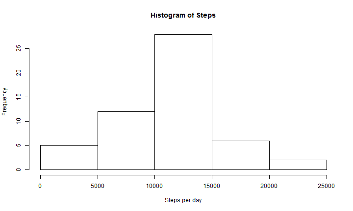
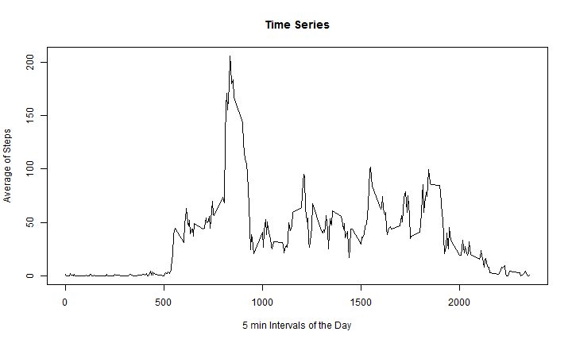
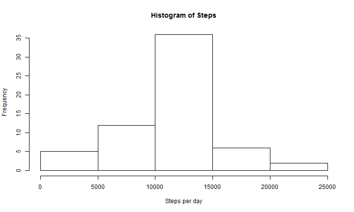
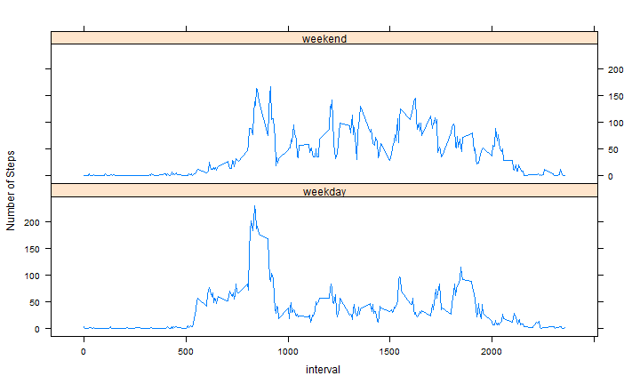

```r
setwd("D:/Users/dia/Downloads/reproducible-research/RepData_PeerAssessment1")
library(knitr)
opts_chunk$set(fig.width=10, fig.height=6, fig.path='figure/',warning=FALSE, message=FALSE)
```

---
title: "Reproducible Research: Peer Assessment 1"
output: 
  html_document:
    keep_md: true
---

## Loading and preprocessing the data

```r
actividad<-read.csv("activity.csv")
acumulado1<-aggregate(steps ~ date, actividad, sum)
acumulado2<-aggregate(steps ~ interval, actividad, mean)
```

## What is mean total number of steps taken per day?


```r
hist(acumulado1$steps,main="Histogram of Steps",xlab="Steps per day")
```

 

### Mean: 

```r
mean(acumulado1$steps)
```

```
## [1] 10766.19
```

### Median:

```r
median(acumulado1$steps)
```

```
## [1] 10765
```

## What is the average daily activity pattern?


```r
plot(acumulado2$interval,acumulado2$steps,type="l",ylab="Average of Steps",xlab="5 min Intervals of the Day",main="Time Series")
```

 

```r
maximo<-acumulado2[acumulado2$steps==max(acumulado2$steps,na.rm = FALSE),]
```

### Maximum average of steps Interval
835

## Imputing missing values


```r
numna<-nrow(actividad[is.na(actividad$steps),])
```

### Number of missing values
2304


```r
actividad2<-actividad
for (i in 1:nrow(actividad))
{
  if (is.na(actividad2$steps[i]))       
    actividad2$steps[i]<-acumulado2[acumulado2$interval==actividad$interval[i],2]
}
```

We filled the NA with the mean of the interval (from all the days)


```r
acumulado3<-aggregate(steps ~ date, actividad2, sum)
hist(acumulado3$steps,main="Histogram of Steps",xlab="Steps per day")
```

 

### Mean of the filled data: 

```r
mean(acumulado3$steps)
```

```
## [1] 10766.19
```

### Median of the filled data:

```r
median(acumulado3$steps)
```

```
## [1] 10766.19
```

#### Do these values differ from the estimates from the first part of the assignment?

We notice that the mean an median differ very little.

#### What is the impact of imputing missing data on the estimates of the total daily number of steps?

We notice that the histogram changes a bit because the sum has greater values.  But the average values don't change much.

## Are there differences in activity patterns between weekdays and weekends?


```r
Sys.setlocale("LC_TIME", "English")
```

```
## [1] "English_United States.1252"
```

```r
#We need to use English Days

actividad2$isweekend <- ifelse( ( (weekdays(as.Date(actividad2$date))=="Sunday") | (weekdays(as.Date(actividad2$date))=="Saturday") ), "weekend", "weekday")
#Day-type set

acumulado4<-aggregate( actividad2$steps, list(actividad2$interval,actividad2$isweekend), FUN = mean )
colnames(acumulado4)<-c("interval","isweekend","steps")
#aggregate of means by interval/day-type

library(lattice)
xyplot(steps ~ interval | isweekend, data = acumulado4, 
       layout = c(1, 2),type="l", ylab="Number of Steps")
```

 
